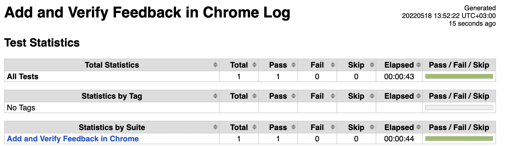
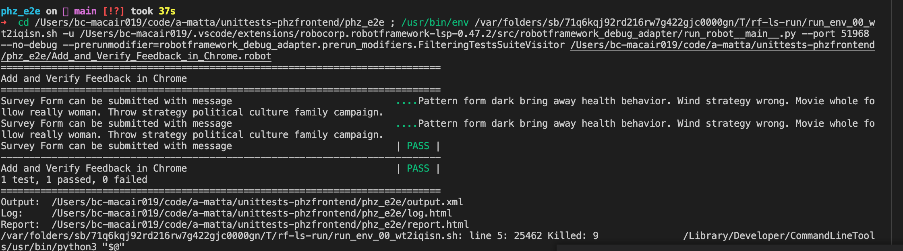

# PHZ Dashboard

# Promoter's Call System

Usage:
git archive --format=tar HEAD | tar x -C ~/workspace/docker/project-name

## 1. Project Description

[Net Promoter Score](https://en.wikipedia.org/wiki/Net_promoter_score) that is widely used metric mesurement system that takes a form of single survey question asking customers to rate the likelihood that they would reccommend a company, product or service to a friend or colleague. It measures the loyalty of customers to a company. Scores are measured with a single question survey with number 1-10, a higher score is desirable.

Promoter's Call System allows buisnesses to collect customer feedback and arrive at NPS scores.

### 1.1. Business Vision

Promoter's Call System use their promoter score to measure 'customer satisfaction' & 'loyalty to a brand'. Its useful for organisations to see how customer service is percieved and where improvements might be made.

### 1.2. Task Management

We are using JIRA to manage & track our tasks, issues.

### 1.3. Personas

User research is a first step to creating a persona. By observing users, the team can understand their behavior and motivations, then create a design accordingly.

### 1.4. Use Cases

Customer 1 is asked a simple question how likely are you to reccommend this company to friend or relative?
Not at all likely 0 to extremely likely 10 based on their responses or ratings customes are placed into three categories.
Customer's feedback is expressed their views in their own words.
If 100 people answered the question so 40% - Promoters, 50% Passive and 10% Detractors
NPS = 40%-10%= 30%/100= 30

### 1.5. Non-Functional Requirements

https://wiki.phz.fi/NonFunctionalRequirements

The NPS Calculation Formula

To calculate your Net Promoter Score, subtract the percentage of Detractors from the percentage of Promoters. NPS = % promoters - % detractors. It is that simple. So, if 50% of respondents were Promoters and 10% were Detractors, your Net Promoter is a score of 40.

## 2. Architecture

### 2.1. Technologies

All PHZ Full Stack -projects should encapsulate all environments by virtualization. Choose one of the following for your project:

Dev

- React
- CSS
- Firebase
- React ChartJs
- Vagrant/Virtualbox
- Docker-compose/Docker

CI

- use dev -env on ci.in.phz.fi + Jenkins executors running Docker or Vagrant/Virtualbox.
- Jenkins
- (do not use Gitlab CI, or AWS Code Deploy or other CI unless you have a permission from management, can rationalize the exception to management and you know what you are doing)
- Nothing should be run outside virtualization and everything should be wrapped inside the container/virtual machine
- do not pin the projects down on any individual executor, but set up the builds so that they can be run on any executor machine

Staging

- Xen / PHZ Virtual Machines
- PHZ Docker Swarm
- PHZ Kubernetes

Production

- Xen / PHZ Virtual Machines + Baremetal Database db.in.phz.fi
- PHZ Docker Swarm (internal projects only)
- PHZ Kubernetes (internal projects only)
- AWS (customer projects, but customer needs to pay for it and there needs to be a contract in place with the customer before you start to set up the AWS env)

### 2.2. Naming, Terms and Key Concepts

Environments and the configs should be named as

- dev: docker-compose.yml (i.e. use the default names for dev env), but .env.dev
- (ci): use the dev -env on CI
- stg: docker-compose.stg.yml, .env.stg
- prod: docker-compose.prod.yml, .env.prod

### 2.3. Coding Convention

Directory structure

- doc/ for UML documents
- etc/ for nginx, ssh etc configs. Can be cp -pr etc/ /etc to the virtual machine during provisioning and matches the os directory structure
- results/ test results
- reports/ for e.g. code coverage reports
- src/ for source code
  \*\* Note! Source code should be placed under a single folder (src) that can be mounted over Docker -volume or Vagrant -shared folder inside the virtual machine so that node_modules or vendor directory are not on the shared folder. See https://wiki.phz.fi/Docker and https://wiki.phz.fi/Vagrant for further details how to circumvent the problems.
- tests/ for tests

### 2.4. Development Guide

Add here examples and hints of good ways how to code the project. Convert the silent knowledge as tacit knowledge here.

- See https://en.wikipedia.org/wiki/Knowledge_management

## 3. Development Environment

### 3.1. Prerequisites

- NodeJS 16+
- Visual Studio Code
- Firebase

### 3.2. Start the Application

npm install
npm start

### 3.3. Access the Application

### 3.4. Run Tests

Goto repository https://github.com/a-matta/e2ephz & clone

robot -testcasename.robot OR
robot example.robot

### 3.5. IDE Setup and Debugging

Visual Code
Extensions installed

1. Eslint
2. Prettier
3. Import cost
4. Code runner
5. ES7+ React/Redux/React-Native snippets
6. Live server
7. Simple React Snippets
8. Robot Framework Language Server

### 3.6. Version Control

Survey Form https://github.com/a-matta/phz_ps
Backend https://github.com/martin-holland/phz_ps_backend
Dashboard https://github.com/martin-holland/ps_phz_dashboard
e2e-tests https://github.com/a-matta/e2ephz

### 3.7. Databases and Migrations

Firebase

### 3.8. Continuous Integration

## 4. Staging/Production Environment

### 4.1. Prerequisites

From repository https://github.com/a-matta/e2e-tests-phz, clone and

1. install Python3 & pip
2. pip install robotframework(5.0)
3. check robot version - robot --version
4. Install relevant browser drive and add to PATH. For example webdrivermanager firefox chrome --linkpath /usr/local/bin

### 4.2. Customizing Tests

The UI tests run with Chrome by default. To run in a different browser ensure the driver is in path and run the tests with variable override. For example to run with firefox use --variable BROWSER:firefox

### 4.3. Smoke Tests

1. Login to dashboard.
2. Check if filtering of dates works.
3. Check if reset of dates works.
4. Check if data is seen in descending order.

#### 4.3.1. Automated Test Cases

1. User can login and view dashboard.
2. Filter and view dates.

#### 4.3.2. Manual Test Cases

Browser : Edge

| Test Scenario                                                  |                                 Expected Results                                  |                                                    Actual Results |
| -------------------------------------------------------------- | :-------------------------------------------------------------------------------: | ----------------------------------------------------------------: |
| Launch Dashboard form at https://promoterscore-tg.netlify.app/ |                     dashboard form loads successfully working                     |                                     dashboard form is functioning |
| Check response when valid email-id/password is entered         |                           Enter valid Email & Password                            |                                        Login should be successful |
| Check response with invalid email-id/password                  |               when heart icon is clicked feedback form can be seen                |     should not work, user cannot login to dashboard without login |
| Check if logout button works                                   |                        User should be taken back to login                         |                           works, user is taken back to login page |
| Check if theme work                                            |                      colour theme should be changed to dark                       |                        works, on click turns to darker background |
| Check if after login, theme is same as previously set          | User changes theme and logs off, and logins again my previous theme should be set |                                       works as per functionality. |
| Check if filter works for previous month                       |         entered values 01.01.2019 - 01.01.2020 and clicked filter button          | works as expected,shows no data incase filter values don't match. |
| Check filter works for different dates                         |         entered values 01.01.2019 - 01.01.2020 and clicked filter button          | works as expected,shows no data incase filter values don't match. |
| Check if burger menu works                                     |                 When 3 bar icon is clicked it should open LHS bar                 |                                           Navigation works nicely |
| Check if reset button works                                    |         when rest button is clicked all values are seen in default state          |                                    all default messages are seen. |

Browser : Safari

| Test Scenario                                                  |                                 Expected Results                                  |                                                    Actual Results |
| -------------------------------------------------------------- | :-------------------------------------------------------------------------------: | ----------------------------------------------------------------: |
| Launch Dashboard form at https://promoterscore-tg.netlify.app/ |                     dashboard form loads successfully working                     |                                     dashboard form is functioning |
| Check response when valid email-id/password is entered         |                           Enter valid Email & Password                            |                                        Login should be successful |
| Check response with invalid email-id/password                  |               when heart icon is clicked feedback form can be seen                |     should not work, user cannot login to dashboard without login |
| Check if logout button works                                   |                        User should be taken back to login                         |                           works, user is taken back to login page |
| Check if theme work                                            |                      colour theme should be changed to dark                       |                        works, on click turns to darker background |
| Check if after login, theme is same as previously set          | User changes theme and logs off, and logins again my previous theme should be set |                                       works as per functionality. |
| Check if filter works for previous month                       |         entered values 01.01.2019 - 01.01.2020 and clicked filter button          | works as expected,shows no data incase filter values don't match. |
| Check filter works for different dates                         |         entered values 01.01.2019 - 01.01.2020 and clicked filter button          | works as expected,shows no data incase filter values don't match. |
| Check if burger menu works                                     |                 When 3 bar icon is clicked it should open LHS bar                 |                                           Navigation works nicely |
| Check if reset button works                                    |         when rest button is clicked all values are seen in default state          |                                    all default messages are seen. |

Browser : Firefox

| Test Scenario                                                  |                                 Expected Results                                  |                                                    Actual Results |
| -------------------------------------------------------------- | :-------------------------------------------------------------------------------: | ----------------------------------------------------------------: |
| Launch Dashboard form at https://promoterscore-tg.netlify.app/ |                     dashboard form loads successfully working                     |                                     dashboard form is functioning |
| Check response when valid email-id/password is entered         |                           Enter valid Email & Password                            |                                        Login should be successful |
| Check response with invalid email-id/password                  |               when heart icon is clicked feedback form can be seen                |     should not work, user cannot login to dashboard without login |
| Check if logout button works                                   |                        User should be taken back to login                         |                           works, user is taken back to login page |
| Check if theme work                                            |                      colour theme should be changed to dark                       |                        works, on click turns to darker background |
| Check if after login, theme is same as previously set          | User changes theme and logs off, and logins again my previous theme should be set |                                       works as per functionality. |
| Check if filter works for previous month                       |         entered values 01.01.2019 - 01.01.2020 and clicked filter button          | works as expected,shows no data incase filter values don't match. |
| Check filter works for different dates                         |         entered values 01.01.2019 - 01.01.2020 and clicked filter button          | works as expected,shows no data incase filter values don't match. |
| Check if burger menu works                                     |                 When 3 bar icon is clicked it should open LHS bar                 |                                           Navigation works nicely |
| Check if reset button works                                    |         when rest button is clicked all values are seen in default state          |                                    all default messages are seen. |

### 4.4. Rollback

User can reset database from firebase => Go to Firebase Promoter project and Firestore database and in survey_results => delete collection.
WARNING! if survey results are deleted, all test data will be deleted permenently.

### 4.5. Logs




## 5. Operating Manual

The application is using google authentication for users to sign in to access the dashboard.
On the main view the default data always shows results from the past six months. There are several functionalities on the page:

    1. By changing dates, it is possible to filter the data shown on the charts as well as the messaged displayed below. By pressing reset the dashboard data will go into default mode and show the data from the past 6 months.
    2. The bars on the bar chart are clickable. If the user only wants to see the messages displayed of for example promoters of the selected time period, this is possible by clicking on the promoters bar.
    3. The doughnut chart displays the score of the selected time period
    4. The line chart shows the progress of feedback of the selected time period

By clicking on the burger menu on the top left corner, the user is able to see statistics of the received data. The statistics include total responses, confidence of data as well as most used words from the selected time period. In order to receive this data, the user is required to put in the number of employees (team size) of their team.

In order to make this dashboard suitable for their own use, the user must create their own firebase account. Once this is done, they must use the config file of their own firebase and replace the config file within this project as well as the survey form in order to connect the firebase.

### 5.1 Manual Processes

**_Optional_**

To add manual data into firebase database for testing visit:

http://console.firebase.google.com

Steps:

1. Go to Firestore Database where you created the database from section 3.7
2. Click start collection, call collection id: survey_results
3. Click auto id for document id
4. Set up fields like this:

```js
survey_results = {
  createdAt: "2022-05-18T09:58:43.743Z",
  choice: 10,
  message: "",
  surveyResult: "promoter",
};
```

- createdAt is type string. Format is an ISOString [Read more](https://developer.mozilla.org/en-US/docs/Web/JavaScript/Reference/Global_Objects/Date/toISOString)
- choice is a number
- message can be empty, but its type is string.
- surveyResult is a string and should be either: "promoter" "detractor" or "passive"

5. This will allow you to add data to the database manually for testing.

### 5.2.Chartjs

- install reactchartjs

```sh
npm install --save chart.js react-chartjs-2
```

- import chart to your chart component for example importing Doughnut chart.

```sh
import { Doughnut } from 'react-chartjs-2';

const promoters=[23,24,45,67,87,99]
const detractors=[12,14,15,17,18,19]
const passives=[3,4,6,8,9,5]

 const data = {
    labels: ['Jan','Feb','Mar','Apr','May','Jun'],
    datasets: [
      {
        label: "Promoters",
        data: promoters,
      },
      {
        label: "Passive",
        data: passives,
      },
      {
        label: "Detractors",
        data: detractors,
      },
    ],
  };
<Doughnut data={data}  />

```

#### 5.3 Filter and reset Button

- 12 months rolling data is shown as default data whereas data can be filtered using start and end date from calender.Acoording to filter date data gets dispaly in chart and also in the message box accordingly.

- reset button undo the filtering and gives back original 12 months rolling data.

## 6. Problems

### 6.1. Environments

During testing we had issue related to cookie while using mobile phone.

### 6.2. Coding

### 6.3 Notable Dependancies:

    axios 0.26.1
    chart.js 3.7.1
    dayjs: 1.11.1,
    firebase: 9.6.11,
    license-checker: 25.0.1,
    license-to-fail: 4.0.0,
    react: 18.0.0,
    react-chartjs-2: 4.1.0,
    react-dom: 18.0.0,
    react-icons: 4.3.1,
    react-loader-spinner: 6.0.0-0,
    react-redux: 7.2.8,
    react-router-dom: 6.3.0,
    react-scripts: 5.0.1,
    react-tagcloud: 2.2.0,
    reactjs-popup: 2.0.5,
    redux: 4.1.2,
    redux-devtools-extension: 2.13.9,
    redux-thunk: 2.4.1,
    styled-components: 5.3.5,
    thunk: 0.0.1,
    tippy.js: 6.3.7,
